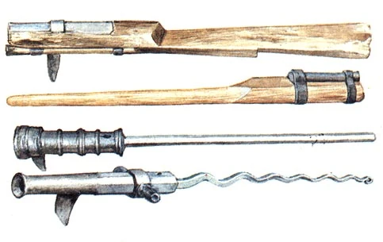
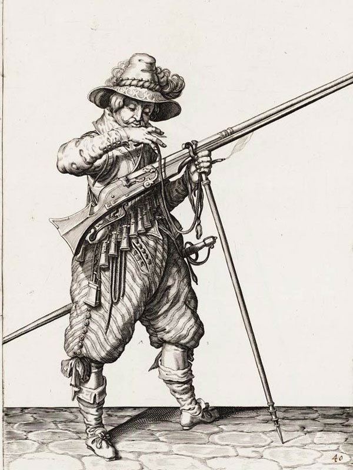
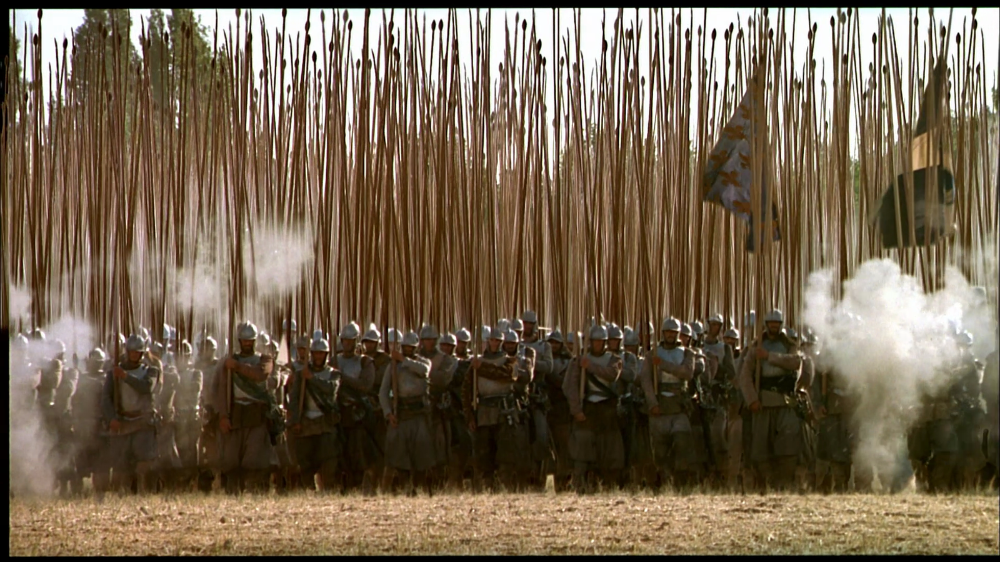
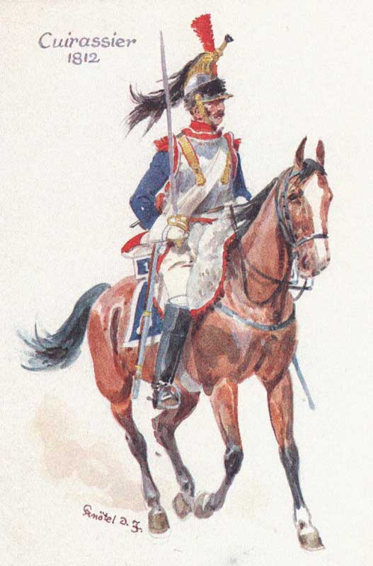

# Ручница - Появление: Конец XIV века

---

# Аркебуза - Появление: Начало XV века

---

# Мушкет - Появление: Начало XVI века

---

# Испанская Пехота - Первая Половина XVII века

---

# Кирасир Франции - 1812 год

---
